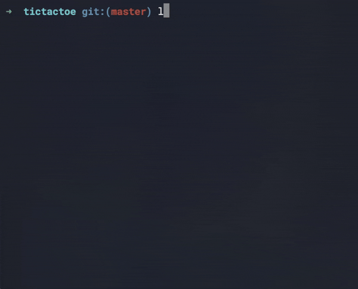
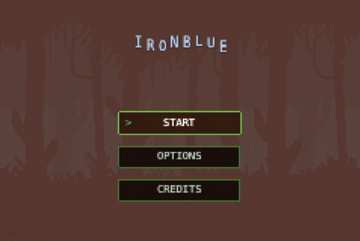
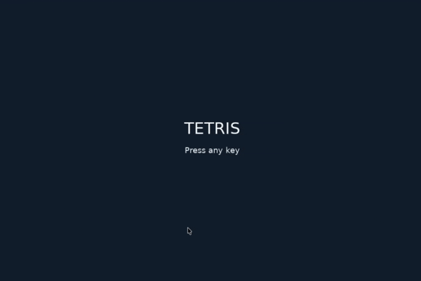

# Assignment 1 Bash: Tic tac toe

## Kółko i krzyżyk

W ramach pierwszego zadania proszę wykonać grę kółko i krzyżyk w
Bashu, który:
- [X] 3.0 - działa w trybie gry turowej,
- [X] 4.0 - pozwala na zapis i odtwarzanie przerwanej gry (save game),
- [X] 5.0 - pozwala na grę z komputerem.

### Project
Go to project [TicTacToe](bash/tictactoe/)

### Demo


### Install the binary with Make
Clone the repository
```bash
git clone git@github.com:pieandcoffe/ScriptGames.git
```
Navigate to the tictactoe directory
```bash
cd ScriptGames/bash/tictactoe
```
Install the binary to the user's local bin directory (Make will compile bash scripts into a binary)
```bash
make install
```
Run the game
```bash
tictactoe
```

# Assignment 2 JS: Mario in PhaserJS

## Mario w PhaserJS
Należy stworzyć prostego runnera (Mario) w PhaserJS.
- [X] 3.0 Należy stworzyć jeden poziom z przeszkodami oraz dziurami w które
można wpaść i zginąć
- [X] 3.5 Należy dodać opcję zbierania punktów
- [X] 4.0 Należy dodać przeciwników, których można zabić oraz 3 życia
- [X] 4.5 Ładowanie poziomów z pliku
- [ ] 5.0 Generator poziomów

### Project
Go to project [Mario](js/platformer/Ironblue/)

### Demo
See [Demo](js/platformer/Ironblue/Demo.gif)



[Play game on Itch.io](https://4packharnas.itch.io/ironblue)

# Assignment 3 Ruby: Crawler

## Crawler w Ruby
Należy stworzyć crawler produktów na Amazonie lub Allegro w Ruby
wykorzystują bibliotekę Nokogiri.
- [X] 3.0 Należy pobrać podstawowe dane o produktach (tytuł, cena), dowolna
kategoria
- [X] 3.5 Należy pobrać podstawowe dane o produktach wg słów kluczowych
- [ ] 4.0 Należy rozszerzyć dane o produktach o dane szczegółowe widoczne
tylko na podstronie o produkcie
- [X] 4.5 Należy zapisać linki do produktów
- [ ] 5.0 Dane należy zapisać w bazie danych np. SQLite via Sequel

### Project
Go to project [Crawler](ruby/crawler/)

### Demo
See [Demo](ruby/crawler/Demo.gif)


Crawler stores data in format shown below:

```json
{
  "title": "Laptop HP 14\" Intel N 8 GB / 128 GB niebieski",
  "url": "https://allegro.pl/events/clicks?emission_unit_id=fd508dac-5779-404c-a185-6d6ec5d1f245&emission_id=22684838-9985-41e5-a4f4-6768992237b7&type=OFFER&ts=1781531638635&redirect=https%3A%2F%2Fallegro.pl%2Foferta%2Flaptop-hp-14-intel-4-rdzenie-8gb-128gb-ram-14-mat-w11-bt5-4-lekki-do-nauki-17918011219%3Fbi_s%3Dads%26bi_m%3Dproductlisting%253Adesktop%253Aquery%26bi_c%3DM2EyNjVjOTgtMGEwZi00YjUyLWE4M2EtZWJmNTU1OGY2ZjFiAA%26bi_t%3Dape&placement=productlisting:desktop:query&sig=1d788fb14b005a4c21d30c04f28820d2",
  "rating": 4.79,
  "properties": {
    "Układ klawiatury": "US international (qwerty)",
    "Przekątna ekranu": "14\"",
    "Seria procesora": "Intel N",
    "Typ dysku twardego": "UFS"
  },
  "price": 1197.0
},
```

# Assignment 4 Lua: Tetris

## Tetris  w Lua
Należy stworzyć grę Tetris w Lua na frameworku [Löve](https://love2d.org/).
- [X] 3.0 Postawowa wersja dekstopowa z obsługą na klawiaturze - minimum 4
rodzaje klocków
- [ ] 3.5 Zapis i odczyt gier
- [ ] 4.0 Dodanie efektów dźwiękowych przy akcjach
- [ ] 4.5 Dodanie animacji przy zbijaniu klocków
- [ ] 5.0 Wersja na iOS lub Android z implementacją touch zamiast klawiatury

### Project
Go to project [Tetris](lua/tetris/)

### Demo
See [Demo](lua/tetris/assets/demo.gif)

To run the game, navigate to the `lua/tetris` directory 

```bash
cd ScriptGames/lua/tetris
```

And run the following command:

```bash
love .
```


 
# Assignment 5 Python: LLM

Należy stworzyć czatbota wraz z filtrem z wykorzystaniem lokalnego
modelu językowego (np. Llama 3, Mistral, Gemma przez Ollama lub
llama-cpp-python).

- [X] 3.0 Czatbot z wytrenowaną umiejętnością (poprzez prompt) obsługi co
najmniej 3 sposobów sformułowania intencji (powitanie, menu,
zamówienie).
- [X] 3.5 Informacje o godzinach otwarcia i pozycjach w menu powinny być
pobierane z pliku konfiguracyjnego (JSON/YAML) i przekazywane do
modelu.
- [ ] 3.5 Informacje o godzinach otwarcia i pozycjach w menu powinny być
pobierane z pliku konfiguracyjnego (JSON/YAML) i przekazywane do
modelu.
- [ ] 4.0 Czatbot musi przetworzyć zamówienie i potwierdzić zakupione
posiłki, a także obsłużyć dodatkowe prośby (np. alergie, modyfikacje
dań). Dane o alergiach, składzie, daniach ładowy z api aplikacji
webowej napisanej we Flasku
(https://flask.palletsprojects.com/en/stable/).
- [ ] 4.5 Czatbot musi potwierdzić, kiedy posiłek będzie dostępny do odbioru
w restauracji (estymacja czasu na podstawie zamówienia).
- [ ] 5.0 Czatbot powinien zapytać o adres dostawy i potwierdzić go, zamiast
opcji odbioru osobistego, weryfikując kompletność danych adresowych.
Zapisać zamówienie przez wywołanie api aplikacji we Flasku. We Flasku
zapisujemy dane zamówienia w bazie.

### Project
Go to project [Chat bot](python/llm/)

### Demo
See [Demo](python/llm/Demo.gif)

