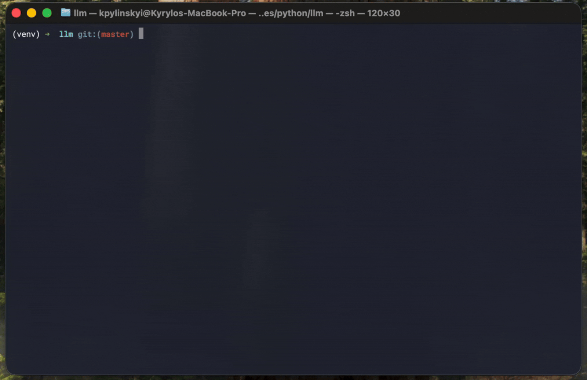

# Python LLM chat bot

Configurable chat bot based on Ollama gemma3:4b model.

## Demo



## Prerequisites

### Ollama
Get Ollama and pull gemma3:4b.
```bash
brew install ollama
ollama pull gemma3:4b
```

## Virtual environment
Set up virtual environment, activate it and install dependencies from requirements.txt.
```bash
python3 -m venv venv
source venv/bin/activate
pip install -r requirements.txt
```

## Run the bot
To launch bot - run the main.py.
```bash
python main.py
```

## Configuration
Edit [system prompt](configuration/system_prompt.txt) to change bot behaviour.
Edit [configuration](configuration/config.json) to change it's knowladge base.